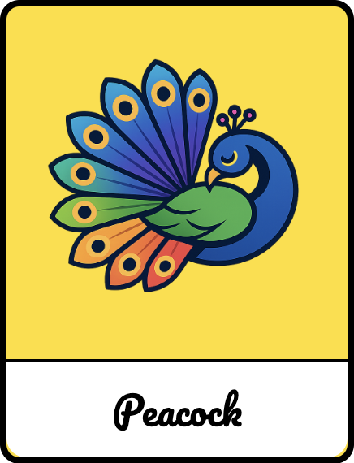

# Peacock
**The foundation for beautiful user interfaces.**

[](https://github.com/redvars/peacock/actions?workflow=Build)
[](/LICENSE)


<div align="center">

</div>

Peacock gives you the tools and foundation to build beautiful, usable product interfaces. It’s the system you use to craft your own component library.

## What is Peacock?
Peacock is more than just a collection of components; it is an aesthetic philosophy. Like its avian namesake, it provides the core elements (the primitives) that allow the full, vibrant display (the design) to be unveiled.

**Opinionated Beauty:** We deliver pre-styled, beautiful components that follow modern design trends, significantly reducing the boilerplate needed to achieve a professional look.

**Foundation First:** Similar to projects like `shadcn/ui`, Peacock focuses on providing the foundational primitives, ensuring maximum flexibility for customization without sacrificing initial polish.

**Seamless Integration:** Designed with modern web frameworks in mind (e.g., React, Vue), integrating Peacock into your existing project structure is fast, efficient, and empowering.

## Key Features
Vibrant & Consistent Design System: Every component—from buttons and cards to complex data tables—shares a cohesive, high-quality visual language.

**Highly Extensible:** The component structure is designed for easy overwriting and theme customization, allowing you to quickly adapt the style to your specific brand identity.

**Built for Accessibility:** Focus on semantic HTML and proper ARIA attributes to ensure that your beautiful interfaces are accessible to all users.

**Responsive by Default:** Components are built with responsiveness baked in, guaranteeing a graceful display across all screen sizes and devices.

## Documentation
Visit [https://peacock.redvars.com](https://peacock.redvars.com) to view the documentation.

## Getting Started


```html
<head>
  
   <!-- Default font : Noto Sans and Noto Sans Mono -->
  <link rel="preconnect" href="https://fonts.googleapis.com">
  <link rel="preconnect" href="https://fonts.gstatic.com" crossorigin>
  <link href="https://fonts.googleapis.com/css2?family=Noto+Sans+Mono:wght@100..900&family=Noto+Sans:ital,wght@0,100..900;1,100..900&display=swap" rel="stylesheet">

  <link rel="stylesheet" href="https://cdn.jsdelivr.net/npm/@redvars/peacock@3.3.0/dist/assets/styles.css"></link>
  <script type='module'
          src='https://cdn.jsdelivr.net/npm/@redvars/peacock@3.3.0/dist/peacock-loader.js'></script>
</head>

<base-button>Button</base-button>
```

# Components

- 🟢 ready (feature complete for now)
- 🟡 beta (changes possible, not feature complete)
- 🔴 not ready (unstyled / no functions)
- 🔵 planned (created, but empty files)

## Input Controls

Input controls are UI design elements that allow users to input information into the system. They are essential for
collecting data and enabling user interactions. Some common examples of input controls include text fields, dropdown
menus, checkboxes, and radio buttons.

| Name                                                                | Component         | State |
|---------------------------------------------------------------------|-------------------|-------|
| [Code editor](https://peacock.redvars.com/components/code-editor)   | card-editor     | 🟢    |
| Color picker                                                        | color-picker    | 🔴    |
| [Checkbox](https://peacock.redvars.com/components/checkbox)         | base-checkbox     | 🟢    |
| [Date picker](https://peacock.redvars.com/components/date-picker)   | date-picker       | 🟡    |
| Date Time picker                                                    | datetime-picker | 🔴    |
| [Form control](https://peacock.redvars.com/components/form-control) | base-field        | 🟡    |
| File picker                                                         | file-picker     | 🔴    |
| [HTML editor](https://peacock.redvars.com/components/html-editor)   | html-editor     | 🟢    |
| [Input](https://peacock.redvars.com/components/input)               | input-field       | 🟢    |
| [Input URL](https://peacock.redvars.com/components/input-url)       | input-url       | 🟢    |
| Month picker                                                        | month-picker    | 🔴    |
| [Number](https://peacock.redvars.com/components/number)             | number-field      | 🟢    |
| [Select](https://peacock.redvars.com/components/select)             | base-select          | 🟢    |
| [Textarea](https://peacock.redvars.com/components/textarea)         | textarea-field    | 🟢    |
| [Time picker](https://peacock.redvars.com/components/time-picker)   | time-picker       | 🟡    |
| [URL input](https://peacock.redvars.com/components/url-input)       | url-input.      | 🔴    |
| Week picker                                                         | week-picker     | 🔴    |

## Navigation

Navigational components are UI elements that help users move around the app or website. They provide users with a clear
and intuitive way to navigate through different sections and pages. Some common examples of navigational components
include menus, tabs, and breadcrumbs.

| Name                                                   | Component       | State |
|--------------------------------------------------------|-----------------|-------|
| [Breadcrumb](https://peacock.redvars.com/components/breadcrumb) | base-breadcrumb | 🟢    |
| [Dropdown](https://peacock.redvars.com/components/dropdown)     | base-dropdown   | 🟡    |
| [Menu](https://peacock.redvars.com/components/menu)             | base-menu       | 🟡    |
| [Tabs](https://peacock.redvars.com/components/tabs)             | base-tabs       | 🟢    |

## Informational

Informational components are UI elements that provide information to users. They communicate important messages,
updates, or instructions within the app or website. Some common examples of informational components
include notifications, tooltips, and progress bars.

| Name                                                                                | Component              | State |
|-------------------------------------------------------------------------------------|------------------------|-------|
| [Badge](https://peacock.redvars.com/components/badge)                               | base-badge             | 🟢    |
| [Linear Progress](https://peacock.redvars.com/components/linear-progress)           | linear-progress        | 🟢    |
| [Circular Progress](https://peacock.redvars.com/components/circular-progress)       | circular-progress      | 🟢    |
| [Spinner](https://peacock.redvars.com/components/spinner)                           | base-spinner              | 🟢    |
| [Tooltip](https://peacock.redvars.com/components/tooltip)                           | base-tooltip           | 🟢    |
| [Notification](https://peacock.redvars.com/components/notification)                 | base-notification         | 🟢    |
| [Notification Manager](https://peacock.redvars.com/components/notification-manager) | base-notification-manager | 🟢    |


## Containers

Containers are UI elements that group similar content together, making it easier for users to navigate and scan through
the interface. Examples of common containers include cards, carousels, and accordions, which provide structure and
organization to the content.

| Name                                                          | Component      | State |
|---------------------------------------------------------------|----------------|-------|
| [Accordion](https://peacock.redvars.com/components/accordion) | base-accordion | 🟢    |
| Card                                                          | base-card         | 🟡    |

## General

These components are used for general purpose. They include

| Name                                                                                | Component                 | State |
|-------------------------------------------------------------------------------------|---------------------------|-------|
| [Avatar](https://peacock.redvars.com/components/avatar)                             | base-avatar               | 🟢    |
| [Button](https://peacock.redvars.com/components/button)                             | base-button               | 🟢    |
| [Button Group](https://peacock.redvars.com/components/button-group)                 | button-group         | 🟢    |
| [Calendar](https://peacock.redvars.com/components/calendar)                         | base-calendar             | 🟢    |
| Card Select                                                                         | base-cardselect           | 🔴    |
| [Code Highlighter](https://peacock.redvars.com/components/code-highlighter)         | code-highlighter     | 🟢    |
| Column                                                                              | base-col                  | 🔴    |
| [Empty State](https://peacock.redvars.com/components/empty-state)                   | empty-state          | 🟡    |
| [Flow Designer ](https://peacock.redvars.com/components/flow-designer)              | flow-designer        | 🔵    |
| Grid                                                                                | base-grid                 | 🔴    |
| Group                                                                               | base-group                | 🔴    |
| [Header](https://peacock.redvars.com/components/header)                             | base-header               | 🟢    |
| [Icon](https://peacock.redvars.com/components/icon)                                 | base-icon                 | 🟢    |
| [Link](https://peacock.redvars.com/components/link)                                 | base-link                 | 🟢    |
| [Modal](https://peacock.redvars.com/components/modal)                               | base-modal                | 🟢    |
| [Notification Manager](https://peacock.redvars.com/components/notification-manager) | notification-manager | 🟡    |
| Observer                                                                            | base-observer             | 🔴    |
| Pagination                                                                          | base-pagination           | 🔴    |
| Radio Group                                                                         | base-radiogroup           | 🔴    |
| Row                                                                                 | base-row                  | 🔴    |
| [Slider](https://peacock.redvars.com/components/slider)                             | base-slider               | 🟡    |
| Spoiler                                                                             | base-spoiler              | 🔴    |
| Stepper                                                                             | base-stepper              | 🔴    |
| [Table](https://peacock.redvars.com/components/table)                               | base-table                | 🟡    |
| [Tag](https://peacock.redvars.com/components/tag) / Chip                            | base-tag                  | 🟢    |
| [Text](https://peacock.redvars.com/components/text)                                 | base-text                 | 🟢    |
| [Tree View](https://peacock.redvars.com/components/tree-view)                       | tree-view            | 🟡    |
| [Switch](https://peacock.redvars.com/components/switch)                             | base-switch               | 🟢    |

## Charts

These components are used to display data in a graphical format. They include

| Name                                                           | Component           | State |
|----------------------------------------------------------------|---------------------|-------|
| [Doughnut Chart](https://peacock.redvars.com/components/chart-doughnut) | chart-doughnut | 🟢    |
| [Pie Chart ](https://peacock.redvars.com/components/chart-pie)          | chart-pie      | 🟢    |


## 📄 License

Peacock is open-source software licensed under the [Apache-2.0 License](LICENSE).

---

Made with 💖 by [shivajivarma](https://shivajivarma.com).
