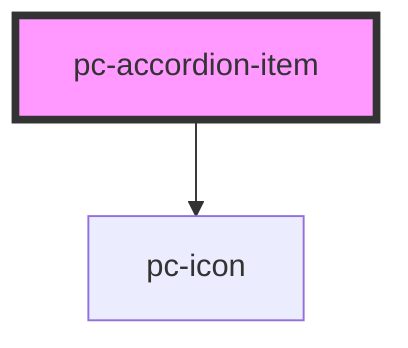

# goat-menu-item

<!-- Auto Generated Below -->

## Properties

| Property   | Attribute  | Description                                                             | Type      | Default     |
| ---------- | ---------- | ----------------------------------------------------------------------- | --------- | ----------- |
| `disabled` | `disabled` | If true, the user cannot interact with the button. Defaults to `false`. | `boolean` | `false`     |
| `heading`  | `heading`  | The menu item value.                                                    | `string`  | `undefined` |
| `open`     | `open`     | Menu item selection state.                                              | `boolean` | `false`     |

## Events

| Event                    | Description                            | Type               |
| ------------------------ | -------------------------------------- | ------------------ |
| `accordion--item--click` | Emitted when the menu item is clicked. | `CustomEvent<any>` |

## Shadow Parts

| Part      | Description |
| --------- | ----------- |
| `"title"` |             |

## Dependencies

### Depends on

- [pc-icon](../../icon)

### Graph

----------------------------------------------

*Built with love!*
