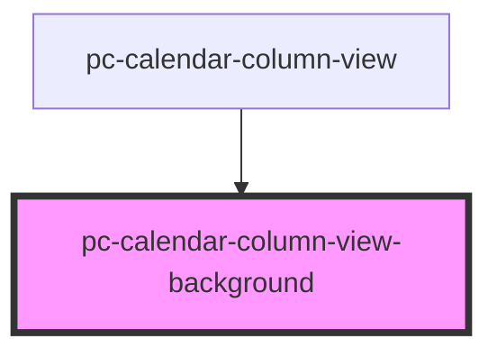

# pc-calendar-column-view-background

<!-- Auto Generated Below -->

## Properties

| Property      | Attribute    | Description | Type   | Default     |
| ------------- | ------------ | ----------- | ------ | ----------- |
| `currentTime` | --           |             | `Date` | `undefined` |
| `dateRange`   | `date-range` |             | `any`  | `undefined` |

## Dependencies

### Used by

 - [pc-calendar-column-view](..)

### Graph

----------------------------------------------

*Built with love!*
