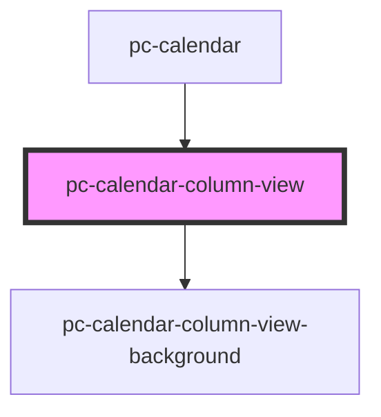

# pc-calendar-column-view

<!-- Auto Generated Below -->

## Properties

| Property         | Attribute         | Description | Type      | Default     |
| ---------------- | ----------------- | ----------- | --------- | ----------- |
| `contextDate`    | --                |             | `Date`    | `undefined` |
| `currentTime`    | --                |             | `Date`    | `undefined` |
| `days`           | `days`            |             | `number`  | `7`         |
| `eventClickable` | `event-clickable` |             | `boolean` | `true`      |
| `events`         | --                |             | `any[]`   | `[]`        |
| `view`           | `view`            |             | `string`  | `'week'`    |

## Events

| Event                              | Description | Type               |
| ---------------------------------- | ----------- | ------------------ |
| `internal-column-view-date-click`  |             | `CustomEvent<any>` |
| `internal-column-view-event-click` |             | `CustomEvent<any>` |

## Dependencies

### Used by

 - [pc-calendar](..)

### Depends on

- [pc-calendar-column-view-background](column-view-background)

### Graph

----------------------------------------------

*Built with love!*
