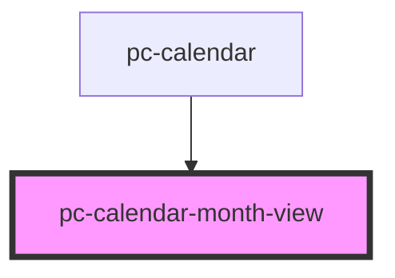

# pc-calendar-column-view

<!-- Auto Generated Below -->

## Properties

| Property         | Attribute         | Description | Type      | Default     |
| ---------------- | ----------------- | ----------- | --------- | ----------- |
| `contextDate`    | --                |             | `Date`    | `undefined` |
| `currentTime`    | --                |             | `Date`    | `undefined` |
| `eventClickable` | `event-clickable` |             | `boolean` | `true`      |
| `events`         | --                |             | `any[]`   | `[]`        |

## Events

| Event                             | Description | Type               |
| --------------------------------- | ----------- | ------------------ |
| `internal-month-view-date-click`  |             | `CustomEvent<any>` |
| `internal-month-view-event-click` |             | `CustomEvent<any>` |

## Dependencies

### Used by

 - [pc-calendar](..)

### Graph

----------------------------------------------

*Built with love!*
