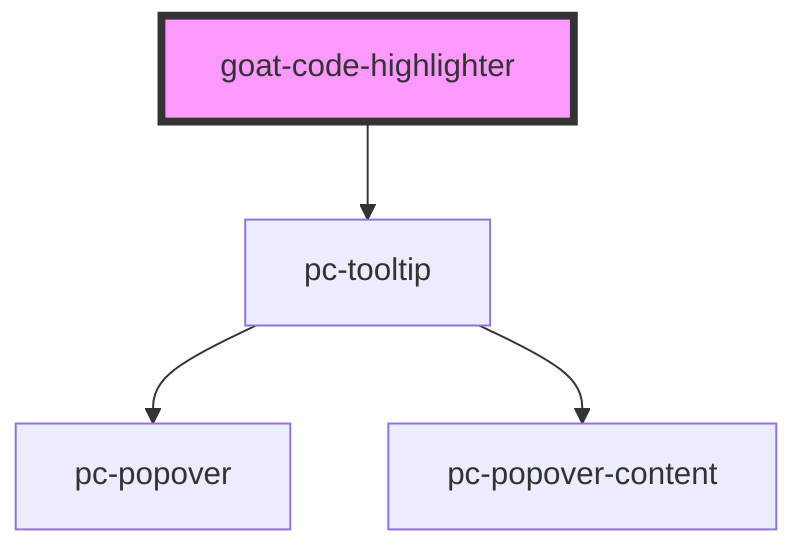

# pc-code-editor

<!-- Auto Generated Below -->

## Properties

| Property      | Attribute      | Description                       | Type                                                                                                                                                                                                                                                                                                                                                                                                                                                                                                                                                                                                                                                                                                                                                                                                                                                                                                                                                                                                                                                                                                                                                                                                                                                                                                                                                                                          | Default        |
| ------------- | -------------- | --------------------------------- | --------------------------------------------------------------------------------------------------------------------------------------------------------------------------------------------------------------------------------------------------------------------------------------------------------------------------------------------------------------------------------------------------------------------------------------------------------------------------------------------------------------------------------------------------------------------------------------------------------------------------------------------------------------------------------------------------------------------------------------------------------------------------------------------------------------------------------------------------------------------------------------------------------------------------------------------------------------------------------------------------------------------------------------------------------------------------------------------------------------------------------------------------------------------------------------------------------------------------------------------------------------------------------------------------------------------------------------------------------------------------------------------- | -------------- |
| `format`      | `format`       | Format the code snippet.          | `boolean`                                                                                                                                                                                                                                                                                                                                                                                                                                                                                                                                                                                                                                                                                                                                                                                                                                                                                                                                                                                                                                                                                                                                                                                                                                                                                                                                                                                     | `undefined`    |
| `hideCopy`    | `hide-copy`    | Hide the copy button.             | `boolean`                                                                                                                                                                                                                                                                                                                                                                                                                                                                                                                                                                                                                                                                                                                                                                                                                                                                                                                                                                                                                                                                                                                                                                                                                                                                                                                                                                                     | `false`        |
| `inline`      | `inline`       | Display the code snippet inline.  | `boolean`                                                                                                                                                                                                                                                                                                                                                                                                                                                                                                                                                                                                                                                                                                                                                                                                                                                                                                                                                                                                                                                                                                                                                                                                                                                                                                                                                                                     | `false`        |
| `language`    | `language`     | The language of the code snippet. | `"abap" \| "actionscript" \| "ada" \| "apacheconf" \| "apl" \| "applescript" \| "arduino" \| "arff" \| "asciidoc" \| "asm6502" \| "aspnet" \| "autohotkey" \| "autoit" \| "bash" \| "basic" \| "batch" \| "bison" \| "brainfuck" \| "bro" \| "c" \| "clike" \| "clojure" \| "coffeescript" \| "cpp" \| "crystal" \| "csharp" \| "csp" \| "css" \| "css-extras" \| "d" \| "dart" \| "diff" \| "django" \| "docker" \| "eiffel" \| "elixir" \| "elm" \| "erb" \| "erlang" \| "flow" \| "fortran" \| "fsharp" \| "gedcom" \| "gherkin" \| "git" \| "glsl" \| "go" \| "graphql" \| "groovy" \| "haml" \| "handlebars" \| "haskell" \| "haxe" \| "hpkp" \| "hsts" \| "html" \| "http" \| "ichigojam" \| "icon" \| "inform7" \| "ini" \| "io" \| "j" \| "java" \| "javascript" \| "jolie" \| "json" \| "jsx" \| "julia" \| "keyman" \| "kotlin" \| "latex" \| "less" \| "lilypond" \| "liquid" \| "lisp" \| "livescript" \| "lolcode" \| "lua" \| "makefile" \| "markdown" \| "markup" \| "markup-templating" \| "matlab" \| "mel" \| "mizar" \| "monkey" \| "n4js" \| "nasm" \| "nginx" \| "nim" \| "nix" \| "nsis" \| "objectivec" \| "ocaml" \| "opencl" \| "oz" \| "parigp" \| "parser" \| "pascal" \| "perl" \| "php" \| "php-extras" \| "plsql" \| "powershell" \| "processing" \| "prolog" \| "properties" \| "protobuf" \| "pug" \| "puppet" \| "pure" \| "python" \| "q" \| "qore" \| "r"` | `'javascript'` |
| `lineNumbers` | `line-numbers` | Display line numbers.             | `boolean`                                                                                                                                                                                                                                                                                                                                                                                                                                                                                                                                                                                                                                                                                                                                                                                                                                                                                                                                                                                                                                                                                                                                                                                                                                                                                                                                                                                     | `false`        |
| `value`       | `value`        | The code snippet to highlight.    | `string`                                                                                                                                                                                                                                                                                                                                                                                                                                                                                                                                                                                                                                                                                                                                                                                                                                                                                                                                                                                                                                                                                                                                                                                                                                                                                                                                                                                      | `''`           |

## CSS Custom Properties

| Name                            | Description                       |
| ------------------------------- | --------------------------------- |
| `--code-highlighter-background` | Code Highlighter background color |

## Dependencies

### Depends on

- [pc-tooltip](../../tooltip)

### Graph

----------------------------------------------

*Built with love!*
