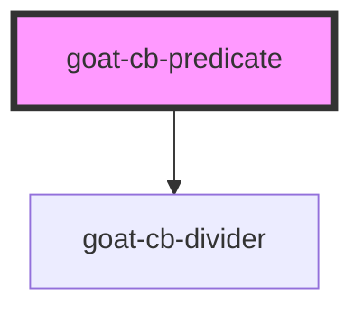

# p-icon

<!-- Auto Generated Below -->

## Properties

| Property            | Attribute            | Description | Type            | Default     |
| ------------------- | -------------------- | ----------- | --------------- | ----------- |
| `conditionOperator` | `condition-operator` |             | `"and" \| "or"` | `undefined` |
| `vertical`          | `vertical`           |             | `boolean`       | `false`     |

## Dependencies

### Depends on

- [goat-cb-divider](../cb-divider)

### Graph

----------------------------------------------

*Built with love!*
