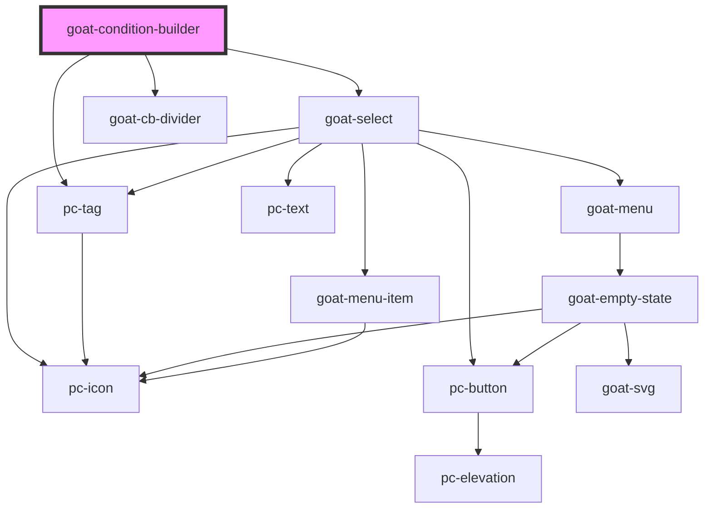

# pc-icon

<!-- Auto Generated Below -->

## Properties

| Property  | Attribute | Description | Type     | Default     |
| --------- | --------- | ----------- | -------- | ----------- |
| `content` | `content` |             | `string` | `undefined` |

## Dependencies

### Depends on

- [goat-select](../../../input-controls/select)
- [goat-cb-divider](../cb-divider)
- [pc-tag](../../../tag)

### Graph

----------------------------------------------

*Built with love!*
