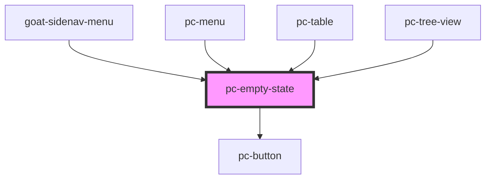

# goat-heading

<!-- Auto Generated Below -->

## Properties

| Property         | Attribute         | Description | Type                                  | Default         |
| ---------------- | ----------------- | ----------- | ------------------------------------- | --------------- |
| `action`         | `action`          |             | `string`                              | `undefined`     |
| `actionDisabled` | `action-disabled` |             | `boolean`                             | `false`         |
| `actionUrl`      | `action-url`      |             | `string`                              | `undefined`     |
| `actionVariant`  | `action-variant`  |             | `"filled" \| "outlined" \| "text"`    | `'filled'`      |
| `description`    | `description`     |             | `string`                              | `undefined`     |
| `headline`       | `headline`        |             | `string`                              | `undefined`     |
| `illustration`   | `illustration`    |             | `"no-document" \| "page" \| "search"` | `'no-document'` |

## Dependencies

### Used by

 - [goat-sidenav-menu](../sidenav-menu)
 - [pc-menu](../../menu/menu)
 - [pc-table](../../table)
 - [pc-tree-view](../../tree-view/tree-view)

### Depends on

- [pc-button](../../button)

### Graph

----------------------------------------------

*Built with love!*
