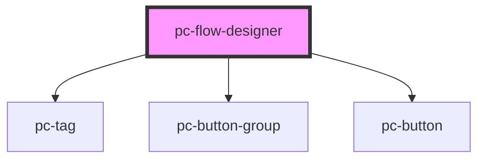

# goat-flow-designer

<!-- Auto Generated Below -->

## Properties

| Property    | Attribute    | Description | Type      | Default |
| ----------- | ------------ | ----------- | --------- | ------- |
| `blockSize` | `block-size` |             | `number`  | `16`    |
| `data`      | --           |             | `any[]`   | `[]`    |
| `disabled`  | `disabled`   |             | `boolean` | `false` |

## Dependencies

### Depends on

- [pc-tag](../../../tag)
- [pc-button-group](../../../button-group)
- [pc-button](../../../button)

### Graph

----------------------------------------------

*Built with love!*
