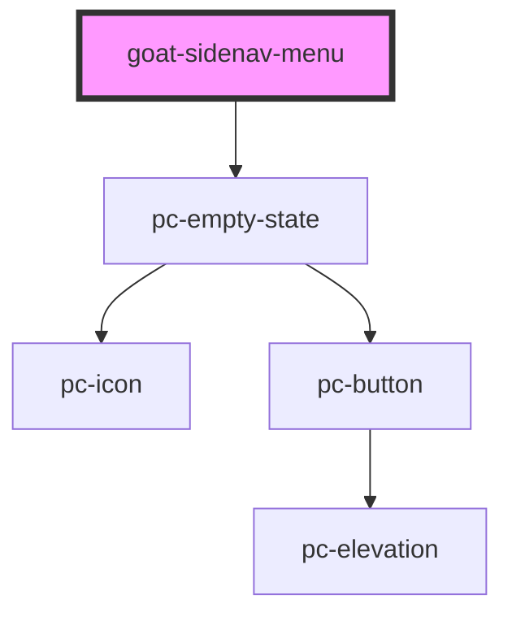

# pc-menu

<!-- Auto Generated Below -->

## Properties

| Property     | Attribute     | Description | Type               | Default                                                                                  |
| ------------ | ------------- | ----------- | ------------------ | ---------------------------------------------------------------------------------------- |
| `empty`      | `empty`       |             | `boolean`          | `false`                                                                                  |
| `emptyState` | `empty-state` |             | `any`              | ``{     "headline": "No items",     "description": "There are no items to display"   }`` |
| `showLoader` | `show-loader` |             | `boolean`          | `false`                                                                                  |
| `value`      | `value`       |             | `number \| string` | `undefined`                                                                              |

## Methods

### `setFocus() => Promise<void>`

Sets focus on first menu item. Use this method instead of the global
`element.focus()`.

#### Returns

Type: `Promise<void>`

## Dependencies

### Depends on

- [pc-empty-state](../empty-state)

### Graph

----------------------------------------------

*Built with love!*
