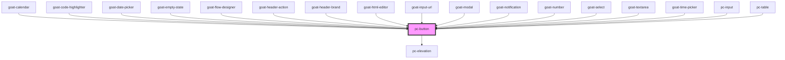

# pc-button

<!-- Auto Generated Below -->

## Properties

| Property         | Attribute         | Description                                                                                                                                                                                                                                                                                         | Type                                                                                   | Default     |
| ---------------- | ----------------- | --------------------------------------------------------------------------------------------------------------------------------------------------------------------------------------------------------------------------------------------------------------------------------------------------- | -------------------------------------------------------------------------------------- | ----------- |
| `appendData`     | `append-data`     | The `appendData` property allows you to attach additional data to the button component. This data can be of any type, making it versatile for various use cases. It's particularly useful for passing extra context or information that can be accessed in event handlers or other component logic. | `any`                                                                                  | `undefined` |
| `color`          | `color`           | Defines the primary color of the button. This can be set to predefined color names to apply specific color themes.                                                                                                                                                                                  | `"black" \| "danger" \| "primary" \| "secondary" \| "success" \| "warning" \| "white"` | `'primary'` |
| `configAria`     | `config-aria`     |                                                                                                                                                                                                                                                                                                     | `any`                                                                                  | `{}`        |
| `disabled`       | `disabled`        | If true, the user cannot interact with the button. Defaults to `false`.                                                                                                                                                                                                                             | `boolean`                                                                              | `false`     |
| `disabledReason` | `disabled-reason` | If button is disabled, the reason why it is disabled.                                                                                                                                                                                                                                               | `string`                                                                               | `''`        |
| `href`           | `href`            | Hyperlink to navigate to on click.                                                                                                                                                                                                                                                                  | `string`                                                                               | `undefined` |
| `iconAlign`      | `icon-align`      | Icon alignment. Possible values are `"start"`, `"end"`. Defaults to `"end"`.                                                                                                                                                                                                                        | `"end" \| "start"`                                                                     | `'end'`     |
| `size`           | `size`            | Button size. Possible values are `"sm"`, `"md"`, `"lg"`. Defaults to `"md"`.                                                                                                                                                                                                                        | `"lg" \| "md" \| "sm" \| "xl" \| "xs"`                                                 | `'sm'`      |
| `target`         | `target`          | Sets or retrieves the window or frame at which to target content.                                                                                                                                                                                                                                   | `string`                                                                               | `'_self'`   |
| `throttleDelay`  | `throttle-delay`  | Sets the delay for throttle in milliseconds. Defaults to 200 milliseconds.                                                                                                                                                                                                                          | `number`                                                                               | `200`       |
| `toggle`         | `toggle`          | If true, the button will be in a toggled state.                                                                                                                                                                                                                                                     | `boolean`                                                                              | `false`     |
| `type`           | `type`            | Button type based on which actions are performed when the button is clicked.                                                                                                                                                                                                                        | `"button" \| "reset" \| "submit"`                                                      | `'button'`  |
| `variant`        | `variant`         | The visual style of the button.   Possible variant values: `"filled"` is a filled button. `"outlined"` is an outlined button. `"text"` is a transparent button. `"tonal"` is a light color button.                                                                                                  | `"elevated" \| "filled" \| "neo" \| "outlined" \| "text" \| "tonal"`                   | `'filled'`  |

## Events

| Event              | Description                           | Type                                |
| ------------------ | ------------------------------------- | ----------------------------------- |
| `pc-button--click` | Triggered when the button is clicked. | `CustomEvent<{ appendData: any; }>` |

## Methods

### `setBlur() => Promise<void>`

Sets blur on the native `button` in `pc-button`. Use this method instead of the global
`button.blur()`.

#### Returns

Type: `Promise<void>`

### `setFocus() => Promise<void>`

Sets focus on the native `button` in `pc-button`. Use this method instead of the global
`button.focus()`.

#### Returns

Type: `Promise<void>`

### `triggerClick() => Promise<void>`

Triggers a click event on the native `button` in `pc-button`. Use this method instead of the global
`button.click()`.

#### Returns

Type: `Promise<void>`

## Dependencies

### Used by

 - [goat-calendar](../application/calendar/calendar)
 - [goat-code-highlighter](../application/code-highlighter)
 - [goat-date-picker](../input-controls/data-and-time/date/date-picker)
 - [goat-empty-state](../application/empty-state)
 - [goat-flow-designer](../application/flow-designer/flow-designer)
 - [goat-header-action](../application/header/header-action)
 - [goat-header-brand](../application/header/header-brand)
 - [goat-html-editor](../input-controls/html-editor)
 - [goat-input-url](../input-controls/input/input-url)
 - [goat-modal](../modal/modal)
 - [goat-notification](../notification)
 - [goat-number](../input-controls/input/number)
 - [goat-select](../input-controls/select)
 - [goat-textarea](../input-controls/input/textarea)
 - [goat-time-picker](../input-controls/data-and-time/date/time-picker)
 - [pc-input](../input-controls/input/input)
 - [pc-table](../table)

### Depends on

- [pc-elevation](../elevation)

### Graph

----------------------------------------------

*Built with love!*
