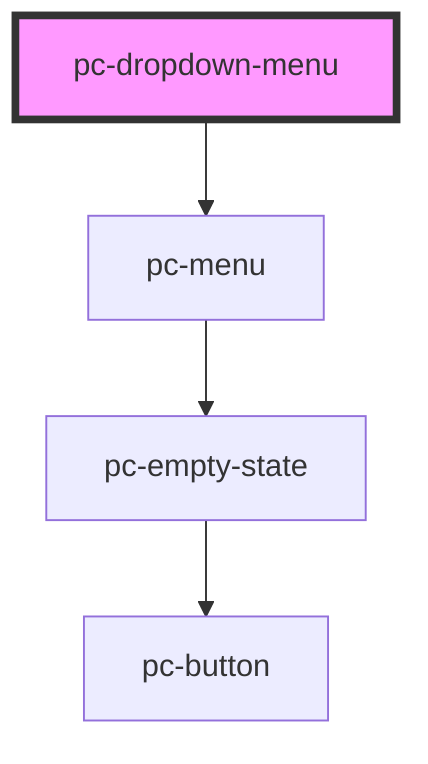

# pc-dropdown

<!-- Auto Generated Below -->

## Methods

### `setFocus() => Promise<void>`

Sets focus on first menu item. Use this method instead of the global
`element.focus()`.

#### Returns

Type: `Promise<void>`

## CSS Custom Properties

| Name                            | Description                |
| ------------------------------- | -------------------------- |
| `--pc-dropdown-menu-max-height` | Maximum height of the menu |

## Dependencies

### Depends on

- [pc-menu](../../menu/menu)

### Graph

----------------------------------------------

*Built with love!*
