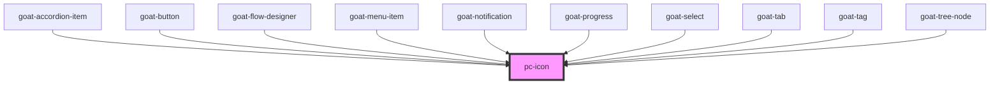

# pc-icon

<!-- Auto Generated Below -->

## Properties

| Property | Attribute | Description                                                                                 | Type     | Default     |
| -------- | --------- | ------------------------------------------------------------------------------------------- | -------- | ----------- |
| `name`   | `name`    | The identifier for the icon. This name corresponds to a specific SVG asset in the icon set. | `string` | `undefined` |

## Dependencies

### Used by

 - [goat-accordion-item](../accordion/accordion-item)
 - [goat-button](../button)
 - [goat-flow-designer](../application/flow-designer/flow-designer)
 - [goat-menu-item](../menu/menu-item)
 - [goat-notification](../notification)
 - [goat-progress](../progress)
 - [goat-select](../input-controls/select)
 - [goat-tab](../tabs/tab)
 - [goat-tag](../tag)
 - [goat-tree-node](../tree-view/tree-node)

### Graph

----------------------------------------------

*Built with love!*
