# pc-icon

<!-- Auto Generated Below -->

## Properties

| Property | Attribute | Description | Type     | Default     |
| -------- | --------- | ----------- | -------- | ----------- |
| `name`   | `name`    |             | `string` | `undefined` |
| `src`    | `src`     |             | `string` | `undefined` |

## Dependencies

### Used by

 - [goat-code-highlighter](../application/code-highlighter)
 - [goat-header-action](../application/header/header-action)
 - [goat-header-brand](../application/header/header-brand)
 - [goat-html-editor](../input-controls/html-editor)
 - [pc-accordion-item](../accordion/accordion-item)
 - [pc-calendar](../application/calendar/calendar)
 - [pc-checkbox](../input-controls/checkbox)
 - [pc-date-picker](../input-controls/data-and-time/date/date-picker)
 - [pc-empty-state](../application/empty-state)
 - [pc-flow-designer](../application/flow-designer/flow-designer)
 - [pc-input](../input-controls/input/input)
 - [pc-input-url](../input-controls/input/input-url)
 - [pc-menu-item](../menu/menu-item)
 - [pc-modal](../modal/modal)
 - [pc-notification](../notification)
 - [pc-number](../input-controls/input/number)
 - [pc-select](../input-controls/select)
 - [pc-tab](../tabs/tab)
 - [pc-table](../table)
 - [pc-tag](../tag)
 - [pc-textarea](../input-controls/input/textarea)
 - [pc-time-picker](../input-controls/data-and-time/date/time-picker)
 - [pc-tree-node](../tree-view/tree-node)

### Graph

```mermaid
graph TD;
  goat-code-highlighter --> pc-icon
  goat-header-action --> pc-icon
  goat-header-brand --> pc-icon
  goat-html-editor --> pc-icon
  pc-accordion-item --> pc-icon
  pc-calendar --> pc-icon
  pc-checkbox --> pc-icon
  pc-date-picker --> pc-icon
  pc-empty-state --> pc-icon
  pc-flow-designer --> pc-icon
  pc-input --> pc-icon
  pc-input-url --> pc-icon
  pc-menu-item --> pc-icon
  pc-modal --> pc-icon
  pc-notification --> pc-icon
  pc-number --> pc-icon
  pc-select --> pc-icon
  pc-tab --> pc-icon
  pc-table --> pc-icon
  pc-tag --> pc-icon
  pc-textarea --> pc-icon
  pc-time-picker --> pc-icon
  pc-tree-node --> pc-icon
  style pc-icon fill:#f9f,stroke:#333,stroke-width:4px
```

----------------------------------------------

*Built with love!*
