# pc-icon

<!-- Auto Generated Below -->

## Properties

| Property | Attribute | Description                                                                                 | Type     | Default     |
| -------- | --------- | ------------------------------------------------------------------------------------------- | -------- | ----------- |
| `name`   | `name`    | The identifier for the icon. This name corresponds to a specific SVG asset in the icon set. | `string` | `undefined` |

## Dependencies

### Used by

 - [goat-calendar](../application/calendar/calendar)
 - [goat-code-highlighter](../application/code-highlighter)
 - [goat-date-picker](../input-controls/data-and-time/date/date-picker)
 - [goat-empty-state](../application/empty-state)
 - [goat-flow-designer](../application/flow-designer/flow-designer)
 - [goat-header-action](../application/header/header-action)
 - [goat-html-editor](../input-controls/html-editor)
 - [goat-input](../input-controls/input/input)
 - [goat-input-url](../input-controls/input/input-url)
 - [goat-menu-item](../menu/menu-item)
 - [goat-modal](../modal/modal)
 - [goat-notification](../notification)
 - [goat-number](../input-controls/input/number)
 - [goat-progress](../progress)
 - [goat-select](../input-controls/select)
 - [goat-tab](../tabs/tab)
 - [goat-table](../table)
 - [goat-tag](../tag)
 - [goat-textarea](../input-controls/input/textarea)
 - [goat-time-picker](../input-controls/data-and-time/date/time-picker)
 - [goat-tree-node](../tree-view/tree-node)
 - [pc-accordion-item](../accordion/accordion-item)

### Graph

```mermaid
graph TD;
  goat-calendar --> pc-icon
  goat-code-highlighter --> pc-icon
  goat-date-picker --> pc-icon
  goat-empty-state --> pc-icon
  goat-flow-designer --> pc-icon
  goat-header-action --> pc-icon
  goat-html-editor --> pc-icon
  goat-input --> pc-icon
  goat-input-url --> pc-icon
  goat-menu-item --> pc-icon
  goat-modal --> pc-icon
  goat-notification --> pc-icon
  goat-number --> pc-icon
  goat-progress --> pc-icon
  goat-select --> pc-icon
  goat-tab --> pc-icon
  goat-table --> pc-icon
  goat-tag --> pc-icon
  goat-textarea --> pc-icon
  goat-time-picker --> pc-icon
  goat-tree-node --> pc-icon
  pc-accordion-item --> pc-icon
  style pc-icon fill:#f9f,stroke:#333,stroke-width:4px
```

----------------------------------------------

*Built with love!*
