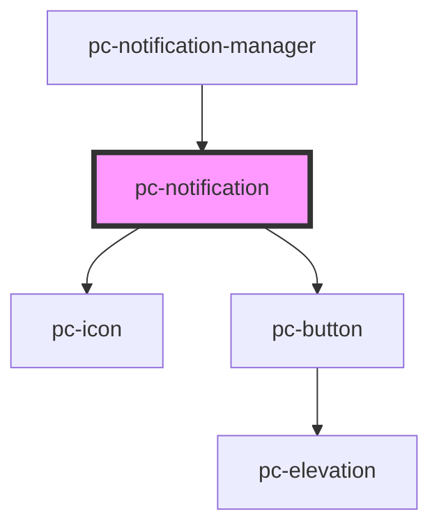

# goat-alert

<!-- Auto Generated Below -->

## Properties

| Property       | Attribute       | Description                                                                               | Type                                          | Default     |
| -------------- | --------------- | ----------------------------------------------------------------------------------------- | --------------------------------------------- | ----------- |
| `action`       | `action`        | Action to be displayed on the notification                                                | `string`                                      | `undefined` |
| `dismissible`  | `dismissible`   | Whether the notification is dismissible                                                   | `boolean`                                     | `false`     |
| `highContrast` | `high-contrast` | Whether to use high contrast mode                                                         | `boolean`                                     | `false`     |
| `inline`       | `inline`        | Whether the notification should be displayed inline                                       | `boolean`                                     | `false`     |
| `managed`      | `managed`       | Whether the notification is managed by the notification manager                           | `boolean`                                     | `false`     |
| `state`        | `state`         | The state of the notification. Possible values are: 'success', 'error', 'info', 'warning' | `"error" \| "info" \| "success" \| "warning"` | `'info'`    |

## Events

| Event                           | Description                                | Type               |
| ------------------------------- | ------------------------------------------ | ------------------ |
| `pc-notification--action-click` |                                            | `CustomEvent<any>` |
| `pc-notification--dismiss`      | Emitted when the notification is dismissed | `CustomEvent<any>` |

## Dependencies

### Used by

 - [pc-notification-manager](../notification-manager)

### Depends on

- [pc-icon](../icon)
- [pc-button](../button)

### Graph

----------------------------------------------

*Built with love!*
