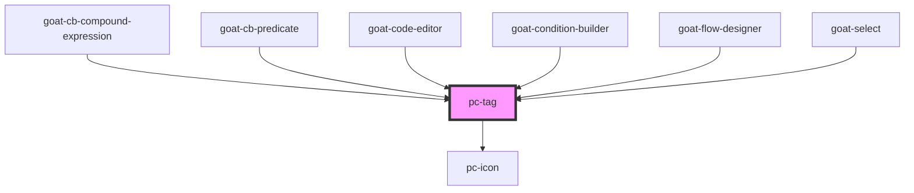

# goat-heading

<!-- Auto Generated Below -->

## Properties

| Property      | Attribute     | Description                                                                                                                 | Type                                                                                                           | Default     |
| ------------- | ------------- | --------------------------------------------------------------------------------------------------------------------------- | -------------------------------------------------------------------------------------------------------------- | ----------- |
| `color`       | `color`       | Tag color. Possible values are: 'gray', 'blue', 'green', 'red', 'yellow', 'primary', 'success', 'info', 'warning', 'error'. | `"blue" \| "error" \| "gray" \| "green" \| "info" \| "primary" \| "red" \| "success" \| "warning" \| "yellow"` | `'gray'`    |
| `dismissible` | `dismissible` | If true, the tag will have a close icon.                                                                                    | `boolean`                                                                                                      | `false`     |
| `imageSrc`    | `image-src`   | Image source.                                                                                                               | `string`                                                                                                       | `undefined` |
| `selected`    | `selected`    | If true, the tag will be selected.                                                                                          | `boolean`                                                                                                      | `false`     |
| `size`        | `size`        | Text size.                                                                                                                  | `"md" \| "sm"`                                                                                                 | `'md'`      |
| `value`       | `value`       | Tag value.                                                                                                                  | `string`                                                                                                       | `''`        |

## Events

| Event             | Description                             | Type               |
| ----------------- | --------------------------------------- | ------------------ |
| `pc-tag--click`   | Emitted when the tag is clicked.        | `CustomEvent<any>` |
| `pc-tag--dismiss` | Emitted when the close icon is clicked. | `CustomEvent<any>` |

## Dependencies

### Used by

 - [goat-cb-compound-expression](../application/condition-builder/cb-compound-expression)
 - [goat-cb-predicate](../application/condition-builder/cb-predicate)
 - [goat-code-editor](../input-controls/code-editor)
 - [goat-condition-builder](../application/condition-builder/condition-builder)
 - [goat-flow-designer](../application/flow-designer/flow-designer)
 - [goat-select](../input-controls/select)

### Depends on

- [pc-icon](../icon)

### Graph

----------------------------------------------

*Built with love!*
