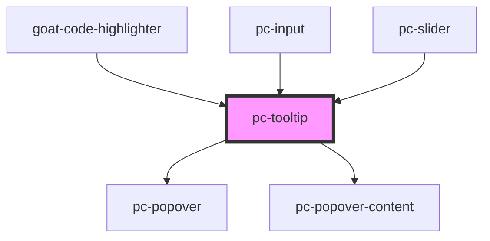

# p-icon

<!-- Auto Generated Below -->

## Properties

| Property     | Attribute    | Description                                                                                                                                                                                                                                                                                                                                                 | Type                  | Default                   |
| ------------ | ------------ | ----------------------------------------------------------------------------------------------------------------------------------------------------------------------------------------------------------------------------------------------------------------------------------------------------------------------------------------------------------- | --------------------- | ------------------------- |
| `content`    | `content`    | The content of the tooltip.                                                                                                                                                                                                                                                                                                                                 | `string`              | `''`                      |
| `placements` | `placements` | The placement of the popover relative to the trigger element. Possible values are: - `"top"`: The popover is placed above the trigger element. - `"right"`: The popover is placed to the right of the trigger element. - `"bottom"`: The popover is placed below the trigger element. - `"left"`: The popover is placed to the left of the trigger element. | `string`              | `'top,bottom,right,left'` |
| `trigger`    | `trigger`    | If true, the tooltip will be managed by the parent component.                                                                                                                                                                                                                                                                                               | `"hover" \| "manual"` | `'hover'`                 |

## Dependencies

### Used by

 - [goat-code-highlighter](../application/code-highlighter)
 - [pc-input](../input-controls/input/input)
 - [pc-slider](../input-controls/slider)

### Depends on

- [pc-popover](../popover/popover)
- [pc-popover-content](../popover/popover-content)

### Graph

----------------------------------------------

*Built with love!*
